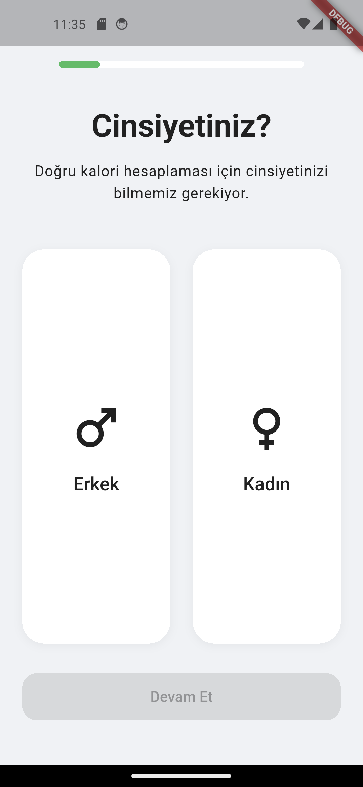
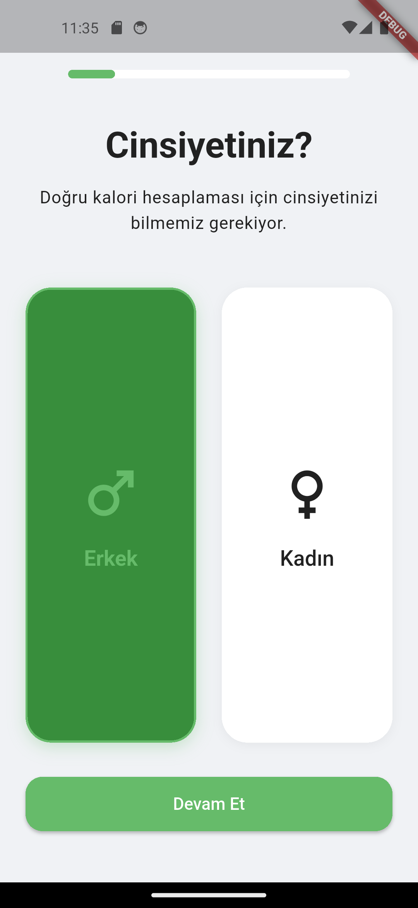
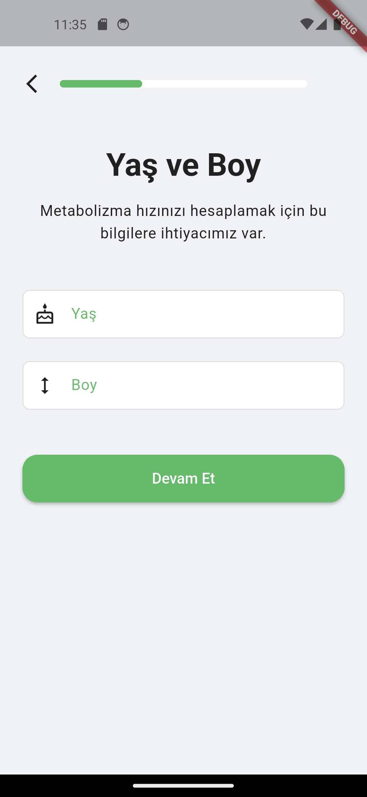
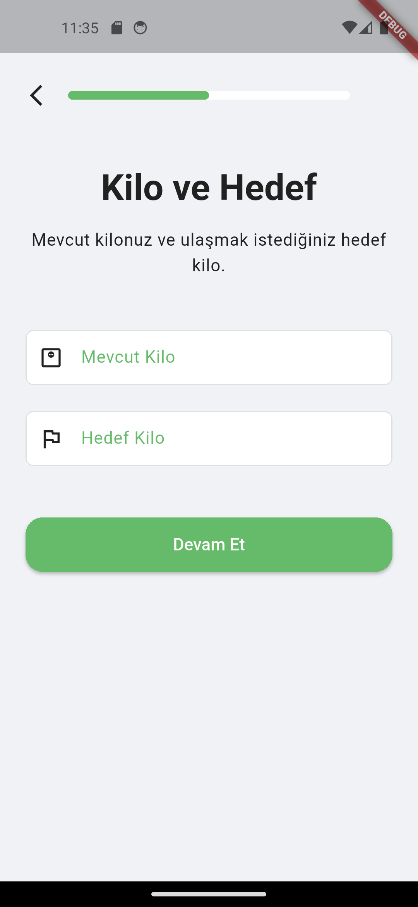
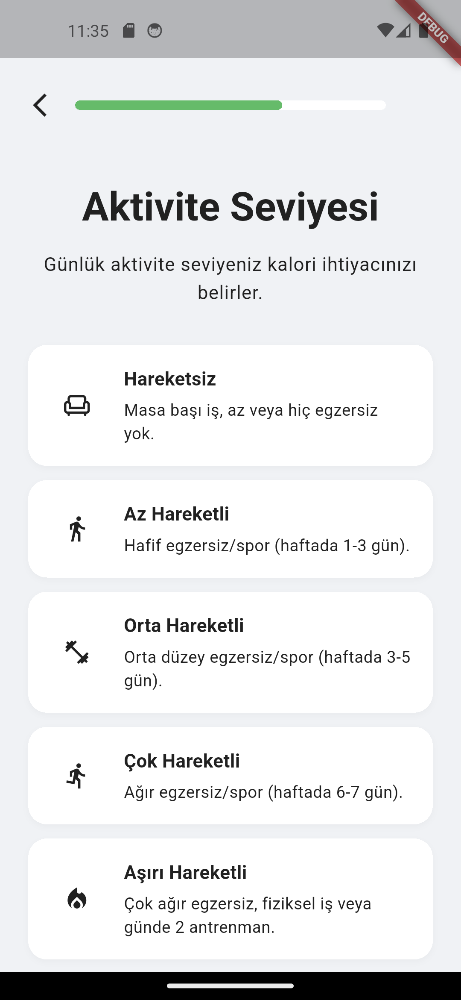
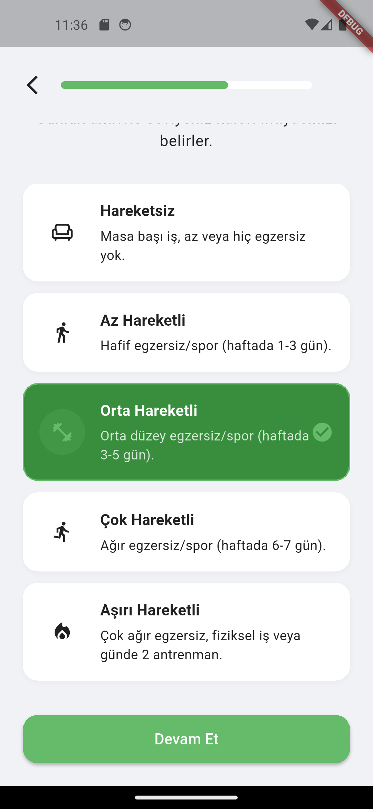
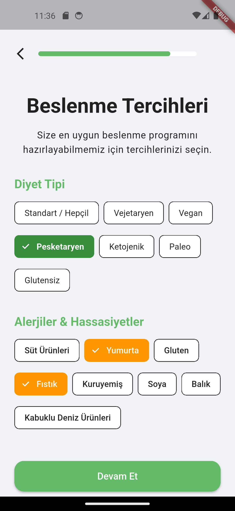
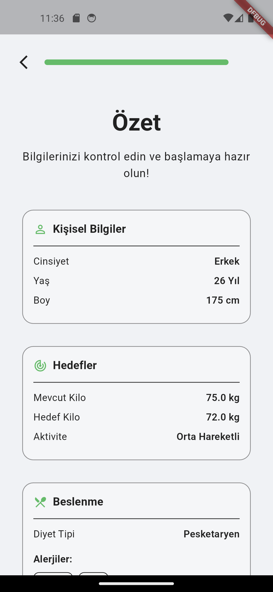
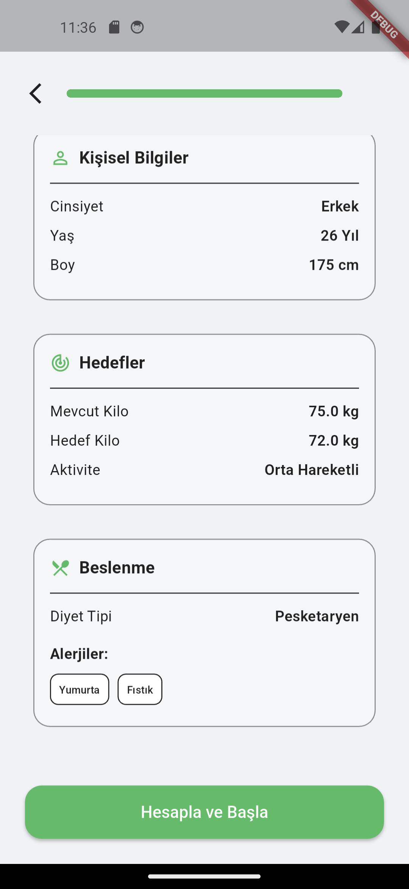

# Calorie Lens AI

Görüntü tabanlı yapay zeka (AI) ile yiyeceklerin kalori ve besin değerlerini tahmin eden, çapraz platform Flutter mobil uygulaması.

An image-based AI mobile application built with Flutter that predicts food calories and nutritional values.

## 📱 Uygulama Görüntüleri / App Screenshots

### 🎯 Onboarding / Karşılama Ekranları

  
  
  
  

### 🔐 Authentication / Kimlik Doğrulama

  
  

### 👤 Onboarding Wizard / Kullanıcı Profili Oluşturma

Yeni kullanıcıların kişisel bilgilerini girerek hesap oluşturması için adım adım süreci.

Step-by-step process for new users to create accounts by entering their personal information.

  
  
  
  
  
  
  
  
  

#### Adımlar / Steps:

- **7.png** - Cinsiyet Seçimi / Gender Selection: Kullanıcının cinsiyetini seçtiği ekran.
- **8.png** - Yaş ve Boy / Age and Height: Kullanıcının yaş ve boy bilgilerini girdiği ekran.
- **9.png** - Kilo ve Hedef / Weight and Goal: Mevcut kilo ve hedef kilo bilgilerinin girildiği ekran.
- **10.png** - Aktivite Seviyesi / Activity Level: Günlük aktivite seviyesinin seçildiği ekran.
- **11.png** - Beslenme Tercihleri / Diet Preferences: Diyet türünün seçildiği ekran.
- **12.png** - Alerjiler / Allergies: Gıda alerjileri ve hassasiyetlerin seçildiği ekran.
- **13.png** - Özet 1 / Summary Part 1: Girilen kişisel bilgilerin özeti (cinsiyet, yaş, boy, kilo).
- **14.png** - Özet 2 / Summary Part 2: Girilen beslenme bilgilerinin özeti (diyet tipi, alerjiler, aktivite).
- **15.png** - Özet Sayfası Devamı / Summary Continuation: Girilen tüm bilgilerin (beslenme, alerjiler) görüntülendiği ve "Hesapla ve Başla" butonu ile onboarding wizard'ı tamamlayan ekran.

## 📋 Proje Yönetimi / Project Management

Proje yönetiminde Trello kullanılmaktadır. / We use Trello for project management.

[Trello Board Link](https://trello.com/b/CmPcXugz/calorie-lens-ai)

## 🛠 Teknolojiler / Technologies

- Flutter
- Dart
- Firebase
- Clean Architecture
- Cubit State Management

## 🏗 Mimari / Architecture

Bu proje temiz mimari (Clean Architecture) prensipleriyle oluşturulmuştur.

This project is built using Clean Architecture principles.