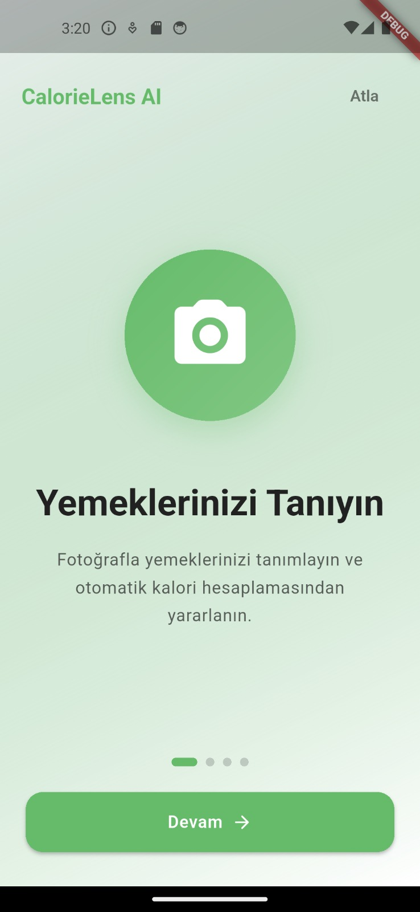
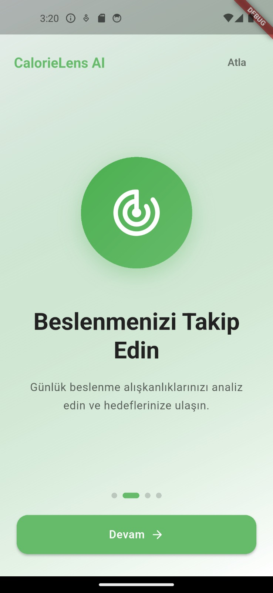
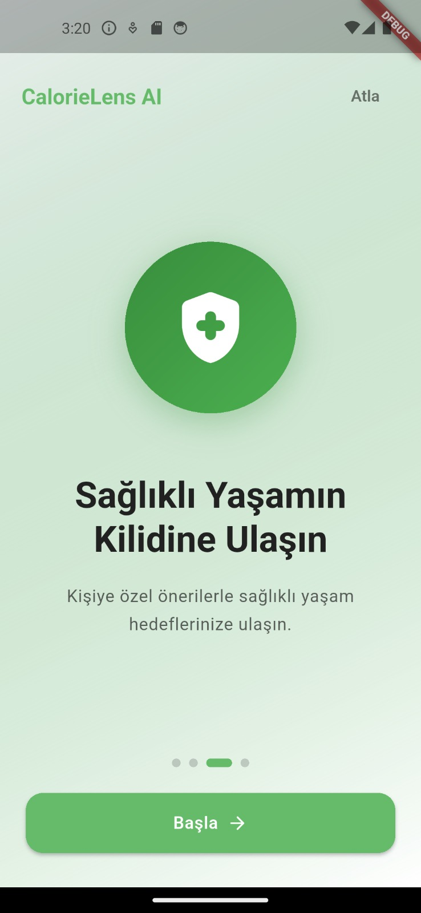
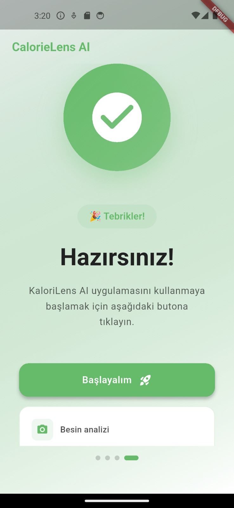
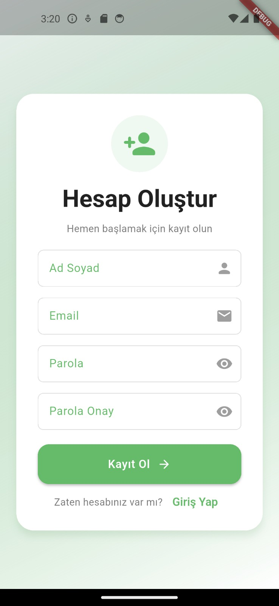
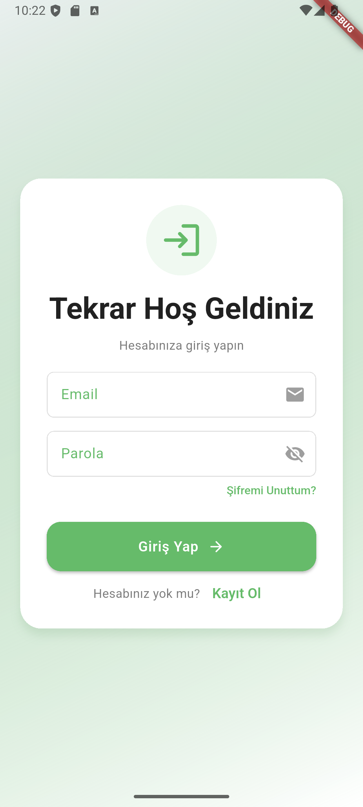

# Calorie Lens AI

Görüntü tabanlı yapay zeka (AI) ile yiyeceklerin kalori ve besin değerlerini tahmin eden, çapraz platform Flutter mobil uygulaması.

An image-based AI mobile application built with Flutter that predicts food calories and nutritional values.

## 📱 Uygulama Görüntüleri / App Screenshots

### 🎯 Onboarding / Karşılama Ekranları

  
  
  
  

### 🔐 Authentication / Kimlik Doğrulama

  
  

## 📋 Proje Yönetimi / Project Management

Proje yönetiminde Trello kullanılmaktadır. / We use Trello for project management.

[Trello Board Link](https://trello.com/b/CmPcXugz/calorie-lens-ai)

## 🛠 Teknolojiler / Technologies

- Flutter
- Dart
- Firebase
- Clean Architecture
- Cubit State Management

## 🏗 Mimari / Architecture

Bu proje temiz mimari (Clean Architecture) prensipleriyle oluşturulmuştur.

This project is built using Clean Architecture principles.
